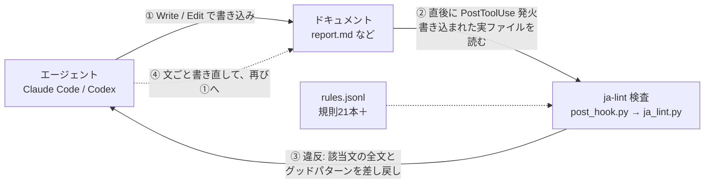
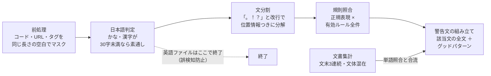
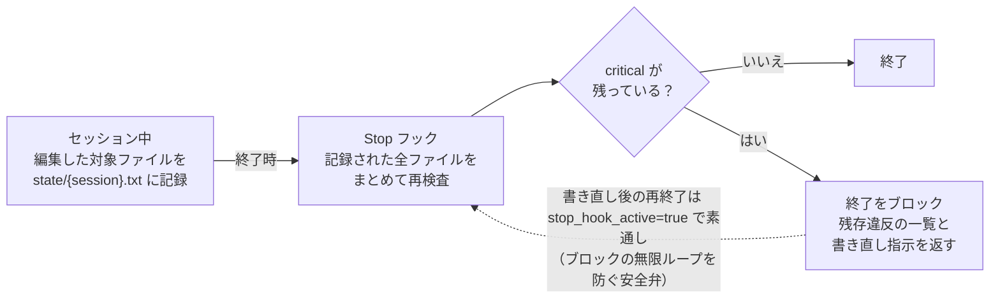

# AIエージェントに書かせた文書、内容は合っているのに日本語がどこか変。そんな経験はないでしょうか。

・効果の中身を書かずに一語で済ませる  
・頼んでいない対比で、否定から入る  
・主語や助詞が抜けて、誰が何をするのか読めない  
・同じ文末が延々と続いて単調になる  

私もこれまでは、Skill や Rules、CLAUDE.md といった指示ファイルに「この表現は使わない」と書き並べて対応してきました。

ただ、プロンプトで渡す指示は守られるかどうかが確率頼みで、会話が長くなると薄まっていきます。モデルが変われば癖の出方も変わります。

その点、メモリーや Hooks のようにプロンプトの外で機械的に働く仕組みは、会話の長さにもモデルの世代にも左右されません。

守らせたいことは、指示より検査に載せるほうが確実。そう割り切って、手で直し続ける生活を仕組みで終わらせました。

作ったのは **ja-lint**。

エージェントがファイルを書いた直後にNGワード検査を自動で掛けて、引っかかった文をエージェント自身に丸ごと書き直させます。Python 5ファイル・依存ゼロ・1ファイル0.1秒・LLM不使用。導入してから、私が日本語を直す回数は目に見えて減りました。

## 中心のループ — 書いたら、すぐ検査される

エージェントがファイルを書き込むと、直後に PostToolUse フックが発火し、書かれたファイルを規則と突き合わせます。違反があれば、警告がエージェント自身へ返ります。人は介在しません。



> **書いた直後の検査ループ。** ③の差し戻しは「処理のブロック」だが書き込みは巻き戻さない。④の書き直しにも同じフックが掛かるため、直りきるまで検査は自然に繰り返される。

肝心なのは、書き込み自体を止めない点です。

書き込みを拒否したり巻き戻したりすると、作業全体が停止して人の介入待ちになってしまいます。ja-lint は書き込みを成功させたうえで、「この文を書き直せ」という指示だけを返す作りです。エージェントは作業の流れを保ったまま、その場で直します。

## 部品は5つ — 検査核と2つのフック

| ファイル | 役割 |
| --- | --- |
| `ja_lint.py` | 検査核。前処理・文分割・規則照合・文書集計・警告文の組み立て。単体の CLI としても動く |
| `post_hook.py` | PostToolUse（Edit / Write / MultiEdit）で発火。書かれたファイルを検査し、違反を差し戻す |
| `stop_hook.py` | Stop（セッション終了時）で発火。編集した全ファイルを再検査し、重大違反が残っていれば終了を止める |
| `rules.jsonl` | 規則の正本。1行1ルールで、人の指摘のたびに追記されて育つ |
| `config.json` | 対象拡張子（.md / .txt）、除外パス、既定プロファイル、警告の最大表示件数 |

配線は Claude Code の settings.json に2行足すだけです。

```json
"PostToolUse": [{ "matcher": "Edit|Write|MultiEdit",
  "hooks": [{ "type": "command", "command": "python3 ~/.claude/hooks/ja_lint/post_hook.py" }] }],
"Stop":        [{ "matcher": "",
  "hooks": [{ "type": "command", "command": "python3 ~/.claude/hooks/ja_lint/stop_hook.py" }] }]
```

## 検査核の中身 — マスクしてから、文で数える

検査は正規表現と集計だけで、LLM は使いません。決定論で動き、1ファイル 0.1秒未満、従量課金もゼロです。内部は5段のパイプラインになっています。



> **検査核 ja_lint.py の5段。** 単語の照合と並行して、文書全体を数える集計が走る。1文ずつ見ても違反と言えない「ます。ます。ます。」の単調さは、ここで初めて指摘できる。

### 前処理は「消す」のに、行番号がずれない

コードフェンス・インラインコード・URL・HTMLタグ・frontmatter は検査対象外です。

ここで消し方に一工夫あって、対象外の範囲を削除せずに同じ長さの空白へ置き換えます。文字数と改行位置が原文と一致したまま保たれるため、違反を報告するとき「◯行目のこの文」と正確に指せます。コードブロックの中に「効く」と書いてあっても反応しません。

### 文書全体の集計で拾う癖

単語照合と別枠で、2つのビルトイン検査が常に走ります。同一の文末（ます・です・ました等を正規化した形）が3文以上続いたら単調として指摘。

です・ます調と常体の混在は、文末の分布を数えて少数派が2割を超えたら指摘。どちらも箇条書きの体言止めは母数から除外して、誤検知を抑えています。

## ルールの形 — 禁止とセットで「こう書く」を返す

規則は JSON Lines で1行1ルール。実物はこうなっています。

```json
{"id": "kiku-001",
 "pattern": "効(?:く|いた|きます|き目)",
 "severity": "critical",
 "label": "効果の中身を書かずに「効く」で済ませる",
 "good": ["何がどれだけ変わるかを数値や具体的な変化で書く",
          "真価は〜にある、と効果の中身を直接示す"],
 "scenes": ["business"], "enabled": true, "min_count": 1}
```

設計上のこだわりが2つあります。

1つ目は good（グッドパターン）を全ルール必須にした点。禁止だけを並べると、エージェントは避け方が分からず不自然な回避文を書きがちです。検出時の警告には、引っかかった語と一緒に書き直しの方向が必ず添えられます。

2つ目は、警告文の契約として語のみの置き換えを禁止した点。

NGワードだけを別の語へ差し替えると、同じ問題が別の語形で残って文章が破綻します。だから警告は「検出箇所を含む文を丸ごと書き直せ」と求めます。エージェントに実際に届く警告の実物がこちらです。

### 朱入れ ― エージェントに返る警告（実物）

この警告を受けたエージェントが、実際にどう書き直したか。検証時のビフォーアフターをそのまま載せます。

| 検出された原文 | エージェントの書き直し |
| --- | --- |
| この施策は ~~非常に効く~~ 。導入することで ~~様々な~~ 課題を解決 ~~することが可能~~ です。手動運用 ~~ではなく~~ 、自動化を進めます。 | この施策により業務効率が大幅に向上し、複数の課題を並行して改善できます。自動化によるプロセス改善を進めます。 |

ルールには scenes（ビジネス文書ではオン・小説ではオフ、のような場面切り替え）と min_count（「なお、」「また、」が3回以上出たら指摘、のような乱用系のしきい値）も持たせました。単発なら自然な表現を、回数で捕まえるための仕掛けです。

## 終了の関門 — 重大違反を残したまま「完了」させない

書き込みごとの検査だけだと、警告を無視して作業を終えられてしまいます。そこで2つ目のフックを Stop（セッション終了時）に置きました。



> **セッション終了時の関門。** PostToolUse 側が違反の有無に関係なく編集ファイルを記録しておき、Stop 側がまとめて再検査する。ブロックは critical のみ対象で、warn だけなら素通し。

PostToolUse 側は違反がなかったファイルも記録します。フックを経ない変化（別ツールでの編集など）があっても、終了時の再検査で捕まえられるからです。ブロック後にもう一度終了しようとしたときは stop_hook_active フラグで素通しさせて、永久に終われない事故を防いでいます。

## ルールが育つループ — 同じ指摘を二度しない

規則は一度にまとめて作ったものだと思われがちですが、逆です。初期投入は15本だけ。あとは私がエージェントの日本語へ指摘を入れるたび、その場で1本ずつ増えていきます。


> **ルールが育つループ。** 指摘をルールへ変える手順自体をスキル（エージェントに手順を教える仕組み）にしてあるため、私が指摘すると半ば勝手に登録されていく。

登録の質を保つ仕掛けが1つあります。スキルは登録時に --test-rule で「指摘された文に当たるか（MATCH）」「正常な文に当たらないか（NO MATCH）」を必ず実測してから完了を報告します。

たとえば「会社の案内」を捕まえるルールを足したときは、「会社案内」「駅の案内板」のような正当な複合語に当たらないことを確かめたうえで登録されました。週1回ほど、会話履歴をエージェント自身に分析させて、繰り返し直している表現をまとめて登録する運用も足してあります。

## 細部の決め事 — 検査ツールがセッションを壊さないために

- **フック内の例外はすべて握りつぶす**  
  規則ファイルの壊れた行も、読めないファイルも、黙ってスキップして無出力で終了します。検査ツールの不具合で本体の作業を止めたら本末転倒だから。

- **日本語30文字未満のファイルは検査しない**  
  かな・漢字を数えて、しきい値未満なら素通しします。英語 README や設定メモへの誤検知を根元から絶つため。

- **規約ファイルとメモリーは除外する**  
  CLAUDE.md・MEMORY.md・ルール自身などは対象外です。NGワードの実例を書く場所を検査したら、自分の尻尾を追いかけることになるから。

- **逃げ道を最初から用意する**  
  環境変数 `JA_LINT=off` で全体を止められます。誤検知で作業が詰まったときの脱出口です。

- **既存 OSS はあえて使わない**  
  同ニッチの標準 textlint + prh（月間ダウンロード100万件級）も実測しました。形態素解析の起動が毎書き込みのフックには重いこと、「文ごと書き直させる」警告文の契約を自前で設計したかったことから、純 Python 自作を選びました。深掘りのフル検査用として将来併用する余地は残しています。

## ハマった罠 — フックがサイレントに全滅していた

構築中に一つ、大きな落とし穴を踏みました。組織の管理設定（managed-settings.json）に `allowManagedHooksOnly: true` があると、ユーザー定義のフックはエラーも警告も出ずに全て無視されます。

ja-lint が発火しない原因を追ったら、以前から入れていた別のフック群まで、この設定のせいで数週間サイレントに止まっていたと分かりました。フックを設定したのに動かないときは、自分の settings.json を疑う前にこのキーを確認してください。

## 動かしてみて

この仕組みを入れてから、私が日本語を直す回数は目に見えて減りました。

ゼロにはなっていません。それでも、同じ指摘をくり返す場面は消えつつあります。

指摘した瞬間にルール化すれば、次からは機械が代わりに指摘してくれるからです。LLM の日本語の癖は、モデルの進化を待たずに、検査と書き直しのループでかなり抑えられます。まずは自分がよく直している表現を書き出して、ファイル書き込み直後のフックで照合するところから始めてみてください。正規表現の照合だけでも、手直しの回数は変わるはずです。
